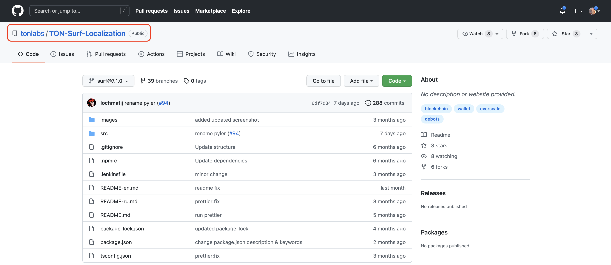
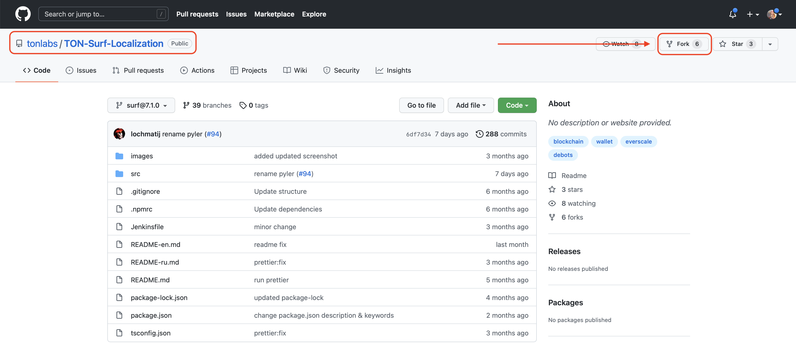
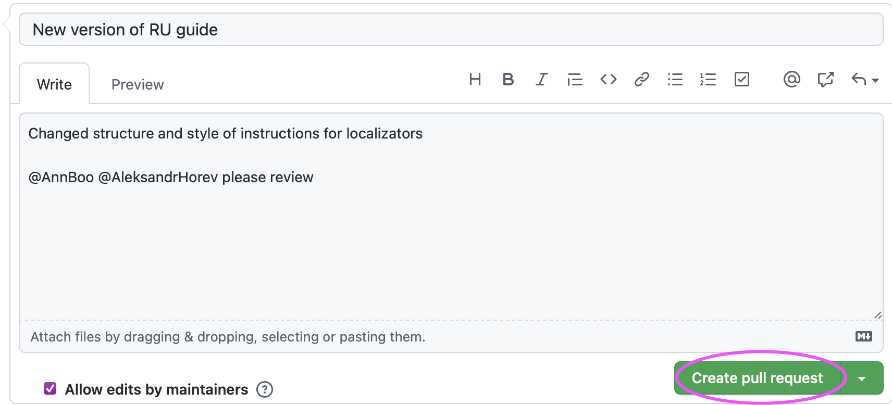

# Guide for Localization in GitHub

All localization files of the Surf app are stored on GitHub. You need a GitHub account to access them. If you haven’t previously used GitHub, please [create one](https://github.com/signup?ref_cta=Sign+up&ref_loc=header+logged+out&ref_page=%2F&source=header-home).

## Create a repository copy

All changes to the strings you make in your own repository without affecting the original TON Surf repository.

1. Go to the [TON-Surf-Localization](https://github.com/tonlabs/TON-Surf-Localization) repository.
   
2. In the upper right corner, click **Fork**.
   
3. Select where GitHub will copy the TON-Surf-Localization repository.

Now you have a copy of the TON-Surf-Localization repository and you are ready to edit strings.

## Open file for edit

You can edit files right in GitHub or download them to your computer and edit locally.

### Edit on GitHub

1. Click on the file you want to edit.
2. Click the pencil icon.
   

The file opens in GitHub build-in editor.

### Download file

1. Click on the file you want to edit.
2. Right-click the **Raw** button and select **Download Linked File**.
   
   The name of the context menu varies from the browser you use.

File downloaded on your computer. Now you can open it with any editor supporting JSON format. For example, VSCode or Notepad++

## Check a string ID

Sometimes different strings can have the same translation. To know exactly what string you change, you can enable the Localization Helper in the Surf app.

1. Open [Surf for Translators](https://ton-surf-translate.firebaseapp.com/).
2. In the upper left corner, click the Surf icon.
3. Select **Advanced settings**.
4. Select **Language**.
5. Click **Enable localization helper**.

Now, when you put the cursor in the string, its ID is displayed above the screen.

## Commit changes

Once you're satisfied with your work, you can open a pull request to merge the changes in your repository into TON-Surf-Localization.

1. Scroll down to the end of the file editor page.
2. Click **Commit changes**.

If you make translations locally, copy changed strings. Then, open a file for edit in GitHub and paste changes there.

## Create Pull Request

Pull Request allows you to merge your changes to the original repository. When creating the pull request follow these rules:

-   Create one Pull Request for one language. If you edit two or more languages, create separate Pull Requests.
-   Pull Requests are accepted only for the latest version of the application.

Make sure that your changes correspond to the JSON format. You can use, for example, <https://jsonformatter.curiousconcept.com/>

1. Open the **Pull Requests** tab.
   
2. Click **New pull request**.
   
3. Click **Create pull request**.
   
4. Enter a title and describe the changes.
5. Tag people who you want to review these changes by mentioning their usernames, for example, @AnnStepanova. List of reviewers you can check here.
   
6. Click **Create pull request**.

As you aren’t a member of Team Surf, you’ll see the following message after creating pull request:

Don’t worry, people you’ve mentioned will receive notifications to review and take a look at your changes.

Your changes appear in the app within a few weeks after the approval and acceptance of the Pull Request.

## Subscribe to updates

To receive notifications when strings changed and you need to take part in review, you need to set up participating notifications in GitHub.

1. In the upper-right corner of the page, click your profile photo, then select **Settings**.
   
2. In the **Account settings** menu, select **Notifications**.
3. 
4. In the **Participating** section, select how you want to receive notifications: **Email** or **Web and Mobile**.
   

Now, you never miss strings changes that require your attention. When someone @mentions your username, you get it right away.

## Review and approve changes

When someone asks you to review updated strings, you can give the green light to the changes or ask the author to improve translations.

1. Open notification where you were mentioned as a reviewer.
2. Go to the **Files changed** tab.
   
3. Review edited strings. If you want to discuss changes with its author, you can leave comments by clicking **+** next to the string number.
   
4. If edited strings have no mistakes, click **Review changes**.
   
5. Select **Approve** and click **Submit review**.
   
