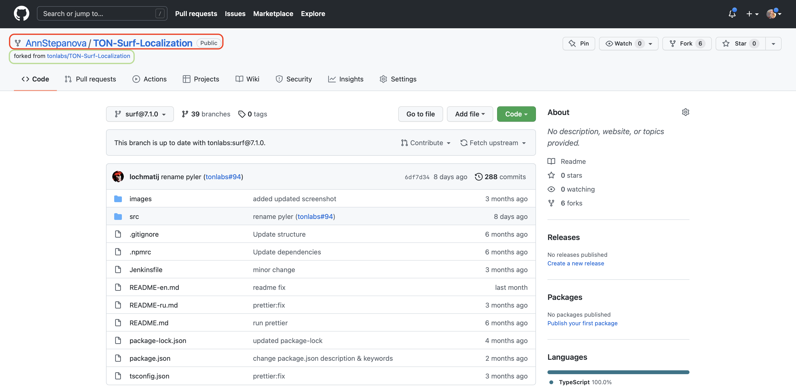
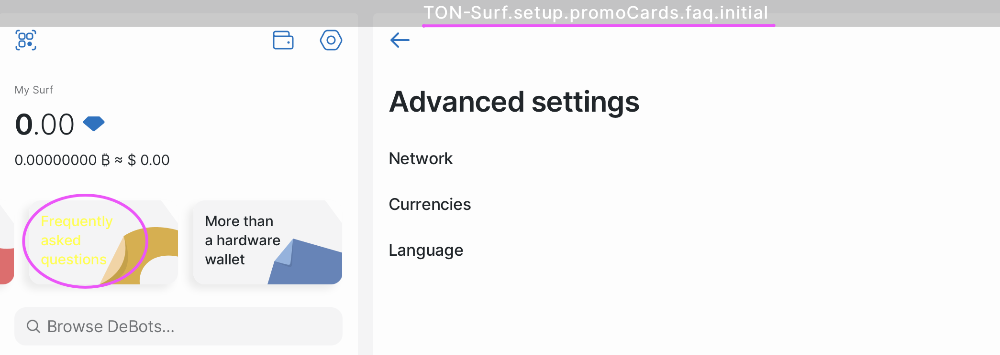
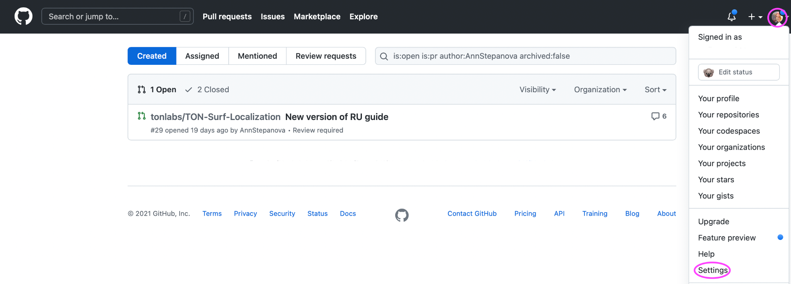
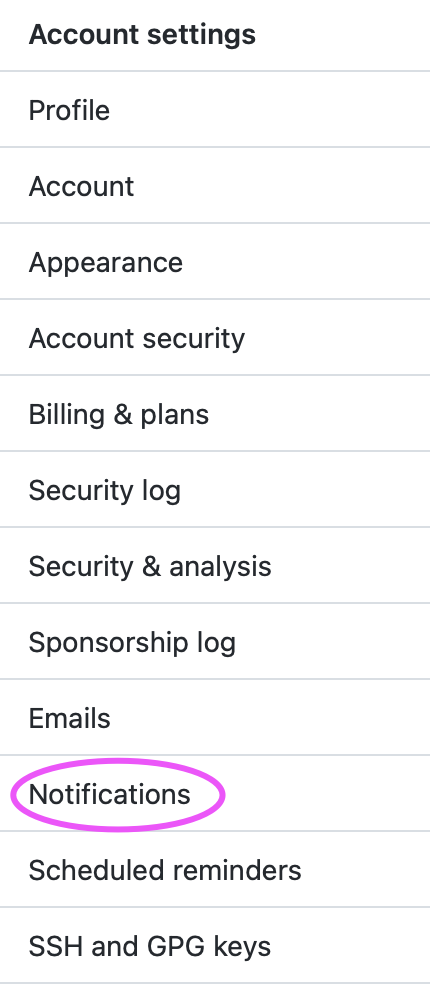
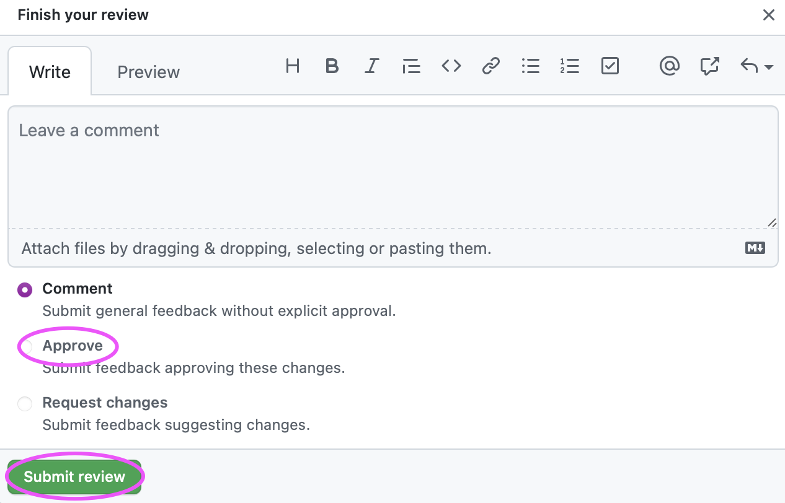

# Как вести локализацию в GitHub

Все файлы локализации Сёрфа хранятся на GitHub. Для доступа к ним вам нужна учетная запись GitHub. Если вы ранее не использовали GitHub, пожалуйста, [создайте ее](https://github.com/signup?ref_cta=Sign+up&ref_loc=header+logged+out&ref_page=%2F&source=header-home).

## Копирование репозитория

Все изменения строк вносятся в файлы в вашем репозитории, чтобы не затрагивать исходный репозиторий TON-Surf-Localization.

1. Перейдите в репозиторий локализации [TON-Surf-Localization](https://github.com/tonlabs/TON-Surf-Localization).
   
2. В правом верхнем углу нажмите на кнопку **Fork**.
   
3. Выберите, куда GitHub скопирует репозиторий локализации TON-SURF.

Теперь у вас есть копия репозитория, и вы можете вносить изменения в строки локализации.

## Редактирование ресурных строк

Вы можете отредактировать файлы прямо в GitHub или скачать их на свой компьютер и редактировать локально.

### Редактирование на GitHub

1. Нажмите на файл, который вы хотите отредактировать.
2. Нажмите на значок карандаша.
   

Файл откроется во встроенном редакторе GitHub.

### Загрузка файла на компьютер

1. Нажмите на файл, который вы хотите отредактировать.
2. Щелкните правой кнопкой мыши по кнопке **Raw** и выберите **Загрузить связанный файл**.
   
   Название контекстного меню зависит от используемого вами браузера.

Файл загрузится на ваш компьютер. Теперь вы можете открыть его в любом редакторе, поддерживающем формат JSON.

## Поиск идентификатора строки

Иногда разные строки могут иметь один и тот же перевод. Чтобы точно знать, какую в какую строку вы вносите изменения, вы можете включить Помощника по локализации в приложении Surf.

1. Откройте [Surf for Translators](https://ton-surf-translate.firebaseapp.com/).
2. В левом верхнем углу нажмите на значок Сёрфа.
3. Выберите **Дополнительные настройки**.
4. Выберите **Язык**.
5. Нажмите **Включить помощника по локализации**.

Теперь, когда вы помещаете курсор на строку, ее идентификатор будет отображаться в верхней части экрана.

## Сохранение изменений

Как только вы закончите вносить изменения, их нужно будет сохранить в вашем репозитории. Оттуда они попадут в репозиторий локализации TON-SURF.

1. Прокрутите страницу вниз до конца
2. Нажмите на кнопку **Commit changes**.

Если вы исправляли строки локально, скопируйте их. Затем откройте файл для редактирования в GitHub и вставьте туда изменения.

## Создание запроса на изменение

Запрос на слияние (Pull Request) позволяет перенести изменения из вашего репозитория в репозиторий локализации TON-Surf-Localization. При создании запроса следуйте этим правилам:

-   Создавайте один запрос для одного языка. Если вы редактируете два или более языков, создайте отдельные запросы для каждого.
-   Запросы принимаются только для последней версии файлов.

1. Перейдите на вкладку **Pull Request**.
   
2. Нажмите **New pull request**.
   
3. Нажмите **Create pull request**.
   
4. Введите название и опишите изменения.
5. Отметьте людей, которые должны подтвердить ваши изменения. Список ревьюиров вы можете посмотреть здесь.
   
6. Нажмите **Create pull request**.

Поскольку вы не являетесь членом Team Surf, после создания запросы вы увидите следующее сообщение:

Все в порядке. Пользователи, которых вы отметили, получат уведомления об изменениях, внесенных вами.

Изменения появятся в приложении через несколько недель после подтверждения запроса на слияние.

## Подписка на обновления

Чтобы вовремя получать уведомления об измененных строках и принимать участие в ревью переводов, вам нужно настроить Participating уведомления в GitHub.

1. В правом верхнем углу страницы нажмите на фото профиля и выберите **Settings**.
   
2. В меню **Account settings** выберите **Notifications**.
3. 
4. В блоке **Participating** выберите, как вы хотите получать уведомления: **Email** или **Web and Mobile**.
   

Теперь вы точно не пропустите изменений, требующих вашего внимания. Когда кто-то отметит вас по имени пользователя, вы сразу получите уведомление.

## Ревью и подтверждение изменений

Когда вас просят поучаствовать в ревью переводов, от вас зависит дать изменениям "зеленый свет" или попросить их автора что-то еще поправить.

1. Откройте уведомление, в котором вас отметили в качестве ревьюера.
2. Перейдите на закладку **Files changed**.
   
3. Просмотрите измененные строчки. Если у вас возникли вопросы по переводу или вы нашли ошибку в тексте, вы можете оставить комментарий к строке следующим образом:
   a) Справа от номера строки нажмите **+**.
   
   b) Укажите свой комментарий и нажмите Add single comment.
     
4. Когда все замечания будут учтены, а ошибки исправлены, нажмите **Review changes**.
   
5. Выберите **Approve** и нажмите **Submit review**.
   
